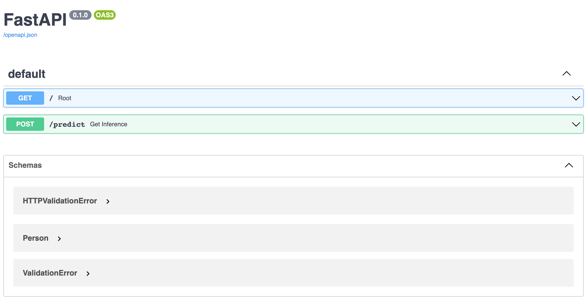
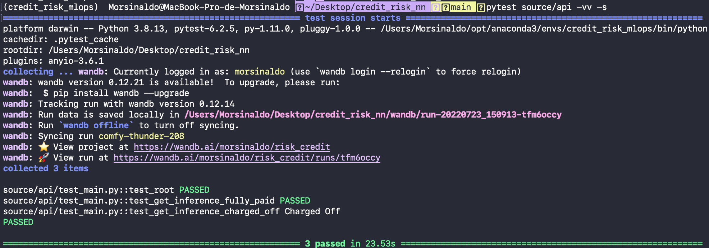

# Credit Risk Neural Network

## Introduction
Credit risk is something that can generate large profits or large losses depending on the size of the risk. So, to try to mitigate the risk of investors losing money, a machine learning model was created that predicts whether a person will pay back the loan on time or not. Obviously, the model is not 100% accurate, and is even a problem involving ethical issues, since a person could pay the loan strictly on time, even if the algorithm has predicted that he or she would not pay. So the model created is only for didactic and scientific purposes.

The data consists of approved loans from 2007 to 2011 from [Lending Club](www.lendingclub.com), a personal loan company that matches borrowers with people who want to lend money to get a financial return on it. The dataset contains 42537 rows and 52 columns and is available on both the github directory and the [Kaggle](https://www.kaggle.com/datasets/samaxtech/lending-club-20072011-data) website.

You can also check out my video in Portuguese on [loom](https://www.loom.com/share/e86f32090c9e47c69e8266cd98bafd42).

## Objectives

The goal of this work is to first show the difference between the various hyperparameters, as it explains what they are. The notebooks created throughout the development of this work are available on GitHub and the artifacts generated throughout these notebooks are saved on the Weights & Biases (W&B or wandb, for short) platform. The deployment of the model will be done on Heroku using FastAPI so that the community can also test and evaluate. The deploying part can be found in more detail in the [article](https://medium.com/@alessandro.pereira.700/from-classic-models-to-production-models-8d4ab873ac4d) ALESSANDRO NETO and I wrote about deploying using Decision Trees. Here we will focus more on neural network optimization. 

The link to the Github repository containing the decision trees part can be found at the following link: https://github.com/Morsinaldo/credit_risk_mlops

## Model Card

The model was deployed to the web using the FastAPI package and API tests were created. The API tests will be embedded in a CI/CD framework using GitHub Actions. After we built our API locally and tested it, we deployed it to Heroku and tested it again live. Weights and Biases were used to manage and track all artifacts.


So, in general, the notebooks used were divided into 7 parts:

  1. [Fetch data](https://github.com/Morsinaldo/credit_risk_nn/blob/main/notebooks/1%20-%20fetch_data.ipynb)
  2. [Exploratory Data Analysis (EDA)](https://github.com/Morsinaldo/credit_risk_nn/blob/main/notebooks/2%20-%20eda.ipynb)
  3. [Pre-Processing](https://github.com/Morsinaldo/credit_risk_nn/blob/main/notebooks/3%20-%20preprocessing.ipynb)
  4. [Data checks](https://github.com/Morsinaldo/credit_risk_nn/blob/main/notebooks/4%20-%20data_check.ipynb)
  5. [Splitting the data between training and testing.](https://github.com/Morsinaldo/credit_risk_nn/blob/main/notebooks/5%20-%20data_segregation.ipynb)
  6. [Train](https://github.com/Morsinaldo/credit_risk_nn/blob/main/notebooks/6%20-%20train.ipynb)
  7. [Test](https://github.com/Morsinaldo/credit_risk_nn/blob/main/notebooks/7%20-%20test.ipynb)

You can read more about the notebook walkthrough in our [Medium]() article

## Anaconda Environment

Create a conda environment with ``environment.yml``:

```bash
conda env create --file environment.yml
```

To remove an environment in your terminal window run:

```bash
conda remove --name myenv --all
```

To list all available environments run:

```bash
conda env list
```

To activate the environment, use

```bash
conda activate myenv
```

## Fast API

The API is implemented in the ``source/api/main.py`` whereas tests are on ``source/api/test_main.py``.

For the sake of understanding and during the development, the API was constanly tested using:

```bash
uvicorn source.api.main:app --reload
```

and using these addresses:

```bash
http://127.0.0.1:8000/
http://127.0.0.1:8000/docs
```

The screenshot below show a view of the API docs.

<center></center>

For test the API, please run:

```bash
pytest source/api -vv -s
```

<center></center>

## Heroku

1. Sign up for free and experience [Heroku](https://signup.heroku.com/login).
2. Now, it's time to create a new app. It is very important to connect the APP to our Github repository and enable the automatic deploys.
3. Install the Heroku CLI following the [instructions](https://devcenter.heroku.com/articles/heroku-cli).
4. Sign in to heroku using terminal
```bash
heroku login
```
5. In the root folder of the project check the heroku projects already created.
```bash
heroku apps
```
6. Check buildpack is correct: 
```bash
heroku buildpacks --app credit-risk-nn
```
7. Update the buildpack if necessary:
```bash
heroku buildpacks:set heroku/python --app credit-risk-nn
```
8. When you're running a script in an automated environment, you can [control Wandb with environment variables](https://docs.wandb.ai/guides/track/advanced/environment-variables) set before the script runs or within the script. Set up access to Wandb on Heroku, if using the CLI: 
```bash
heroku config:set WANDB_API_KEY=xxx --app credit-risk-nn
```
9. The instructions for launching an app are contained in a ```Procfile``` file that resides in the highest level of your project directory. Create the ```Procfile``` file with:
```bash
web: uvicorn source.api.main:app --host=0.0.0.0 --port=${PORT:-5000}
```
10. Configure the remote repository for Heroku:
```bash
heroku git:remote --app credit-risk-nn
```
11. Push all files to remote repository in Heroku. The command below will install all packages indicated in ``requirements.txt`` to Heroku VM. 
```bash
git push heroku main
```
12. Check the remote files run:
```bash
heroku run bash --app credit-risk-nn
```
13. If all previous steps were done with successful you will see the message below after open: ```https://credit-risk-nn.herokuapp.com/```.
14. For debug purposes whenever you can fetch your app’s most recent logs, use the [heroku logs command](https://devcenter.heroku.com/articles/logging#view-logs):
```bash
heroku logs
```

## About Us
My name is Morsinaldo Medeiros and I am a student of the Graduate Program in Electrical and Computer Engineering (PPGeC) at the Federal University of Rio Grande do Norte (UFRN). As the last project of the subject [EEC1509](https://github.com/ivanovitchm/ppgeecmachinelearning) - Machine Learning, course taught by [Ivanovitch Silva](https://github.com/ivanovitchm), I create a machine learning model based on good learning practices and generalization of a neural network.

## References
Heroku: https://credit-risk-nn.herokuapp.com/
Dataset: https://www.kaggle.com/datasets/samaxtech/lending-club-20072011-data
Dr. Ivanovitch Silva's repository: https://github.com/ivanovitchm/ppgeecmachinelearning
Jason Brownlee: Deep Learning for Natural Language Processing. https://machinelearningmastery.com/deep-learning-for-nlp/
François Chollet: Deep learning with Python. https://www.amazon.com/Deep-Learning-Python-Francois-Chollet/dp/1617294438

